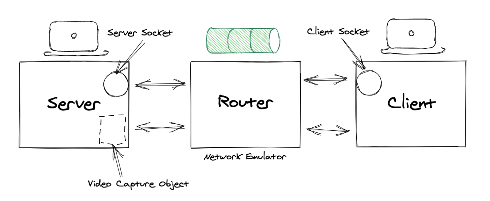

# VideoStreaming-Multipath-TCP-Multipath-QUIC
Application that allows the server to stream video to connected client using Multipath TCP and Multipath QUIC protocols.

##### This is developed as a project for the course IS F462 Network Programming at BITS Pilani.

### Building and Running the Application

##### Prerequisites

- [MPTCP kernel](https://www.multipath-tcp.org/)
- [Mininet](http://mininet.org/)
- [python](https://www.python.org/) (3.8+ recommended)

###### Setting up the mininet network emulation

```sudo python3 configure_mininet.py ```

This sets up a mininet configuration with a client and a server each having 2 links to a router, with port forwarding enabled.

###### [Instructions](MPTCP/README.md) on running MPTCP Streaming
###### [Instructions](MPQUIC/README.md) on running MPQUIC Streaming

#### Architecture

### Team Details
###### Group Number : NP04
1. [Battula Venkata Sai Ankit](https://github.com/saiankit) - 2019AAPS0331H
2. [Sreekar Venkata Nutulapati](https://github.com/sreekarnv) - 2019AAPS1217H
3. [Sidharth Anand](https://github.com/sidharth-anand/) - 2019A7PS1203H
